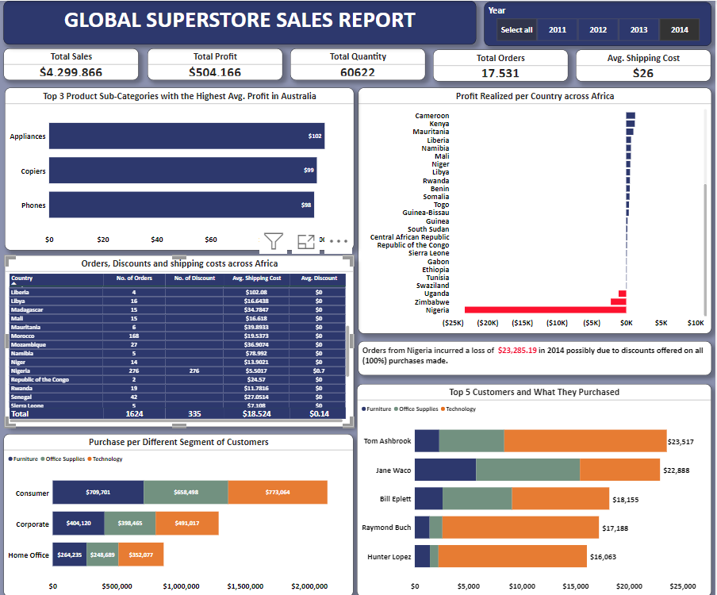

# Global Superstores Sales Report

## Introduction
This is a Power Bi project on sales analysis of **Global Superstore**, a global online retailer based in New York, boasting a broad product catalog and aiming to be a one-stop-shop for its customers. The project is to analyze and draw meaningful insights to answer pertinent questions and aid the management in making informed decisions towards improved performance and profitability. 
**_Disclaimer: _** _This is a dummy data set used to show case Power BI capabilities during my training._

## Project Asks
Question 1.
a) What are the three countries that generated the highest total profit for Global Superstore in 2014?
b) For each of these three countries, find the three products with the highest total profit. Specifically, what are the products’ names and the total profit for each product?

Question 2.
Identify the 3 subcategories with the highest average shipping cost in the United States.

Question 3.
a) Assess Nigeria’s profitability (i.e., total profit) for 2014. How does it compare to other African countries?
b) What factors might be responsible for Nigeria’s poor performance? You might want to investigate shipping costs and the average discount as potential root causes.

Question 4.
a) Identify the product subcategory that is the least profitable in Southeast Asia. Note: For this question, assume that Southeast Asia comprises Cambodia, Indonesia, Malaysia, Myanmar(Burma), the Philippines, Singapore, Thailand, and Vietnam.
b) Is there a specific country in Southeast Asia where Global Superstore should stop offering the subcategory identified in 4a?

Question 5.
a) Which city is the least profitable (in terms of average profit) in the United States? For this analysis, discard the cities with less than 10 Orders. b) Why is this city’s average profit so low?

Question 6.
Which product subcategory has the highest average profit in Australia?

Question 7.
Who are the most valuable customers and what do they purchase?

**Data Source: _https://docs.google.com/spreadsheets/d/1nxESpFzWjlGDMGDVLH69xmDzIl9l6OEq/edit#gid=633280281_**. 
The data set contains 3 csv files namely Orders, People and Returns which were loaded into the power BI platform and transformed for analysis and visualization.

## Skills/Concept Demonstrated
The following skills were incorporated, 
- Power query
- Filters
- COUNTA
- DAX

## Data Cleaning/Transforming
Data was effectively cleaned and transformed using power query editor of Power BI. The column for postal code was deleted as it had only a few entries and was not required for the analysis. Data type for columns, Sales, Discount, Profit and Shipping cost were changed from decimal (1.2) to fixed decimal ($). This ensured there were no blank cells and all data were 100% valid and in the correct data type. Additionally, using the quick measure a COUNTA query was written to count actual discounts.

## Data Modelling
An auto model was generated by Power BI but did not capture all available relationships.Therefore, I adjusted the model to capture all existing and available relationships between the tables.

Auto-model

Adjusted model

## Data Analysis and Visualization
The report is an interactive report comprising of two pages. 

Page 1 highlights top 3 countries and products with the highest profits, least performing cities in USA and the least performing product subcategory in Southeast Asia.

Page 2 highlights Nigeria's performance in comparism to other African countries and the top customers and what they purchased.
   

## Insights
- In the year 2014, a total profit of **$504,166** was generated with USA, India and China being the top 3 countries with the highest profit.
- The sub-category **"Tables"** was the least profitable in Southeast Asia with Indonesia incurring the highest loss for this sub-category from 2012 to 2014.
- Although Nigeria made the highest number of orders **(267)** amongst all African countries in 2014, every product ordered had a discount. Thereby incurring the highest loss, **($23,285.19) ** compared to other African countries.
- Yuma was the City with the least average profit **($480)** in United States.
- The sub-category **"Appliances:** had the highest average profit in Australia.
- Across the three different segments of customers, **"Office supplies"** was the most purchased product category, however across the top 5 customers, **Technology** was the most purchased category.

## Conclusion and Recommendation
- A reduction in shipping cost to Nigeria might encourage more orders from Nigeria as all orders from Nigeria were on discounted products.
- Global Superstores to reconsider the sales of **"Tables"** in Indonesia because this sub-category incurred the highest loss from 2012 to 2014.
